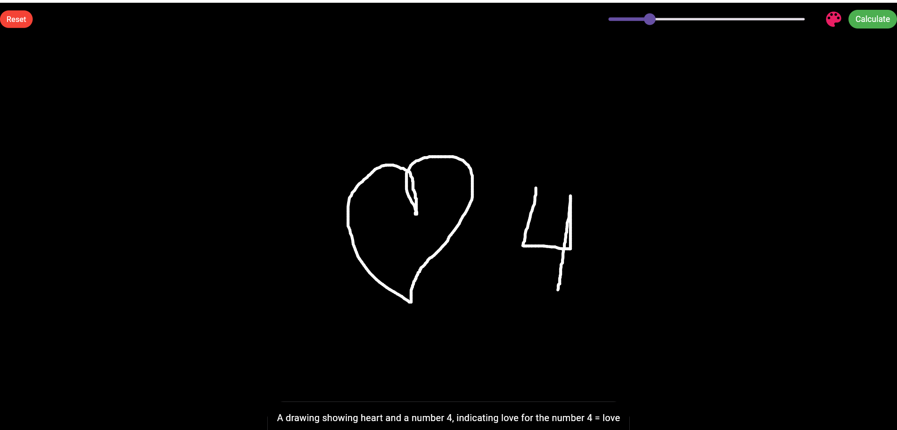
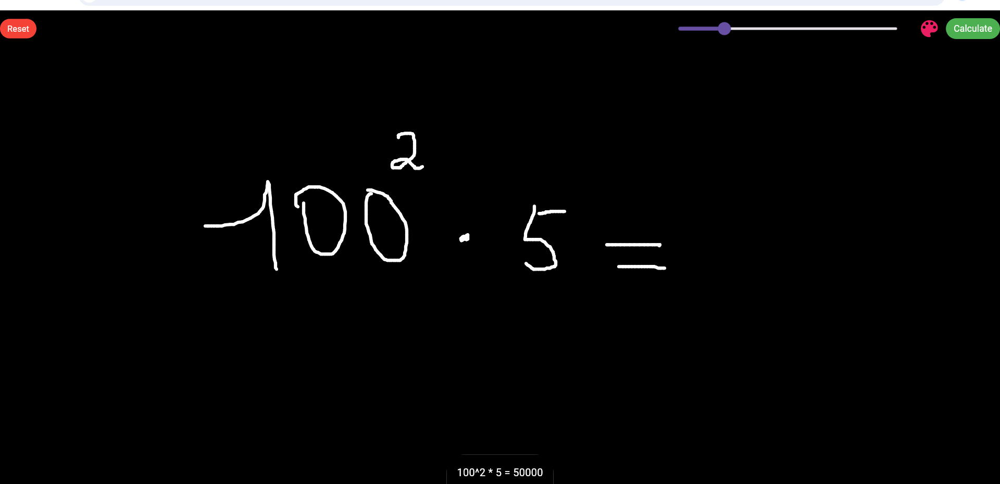

# AI Calc App

## Overview




The **AI Calc App** is a Flutter application designed to provide a simple and interactive drawing experience. Users can draw on the screen, select colors, and set stroke widths. Once the drawing is complete, users can send their artwork to a backend server for processing. The app receives a response containing mathematical expressions derived from the drawing and displays the results to the user.

## Features

- Draw on a canvas with customizable stroke color and width.
- Color picker for selecting drawing colors.
- Option to reset the drawing canvas.
- Capture the drawing and upload it to a backend server.
- Display mathematical expressions and their results received from the server.

## Usage

- Open the app on your mobile device or emulator.
- Use your finger or mouse to draw on the canvas.
- Adjust the stroke width and select your preferred color using the color picker.
- Tap the "Calculate" button to send your drawing to the backend for processing.
- View the mathematical expressions and results displayed in white text on the screen.

## Backend Integration
The app communicates with a backend server via HTTP POST requests. Backend link: 

## Tip

If you want to launch in mobile, try to use 10.0.2.2:8900 instead of localhost:8900
Or get your public IP by using ```ipconfig``` : 192.168.0.109
